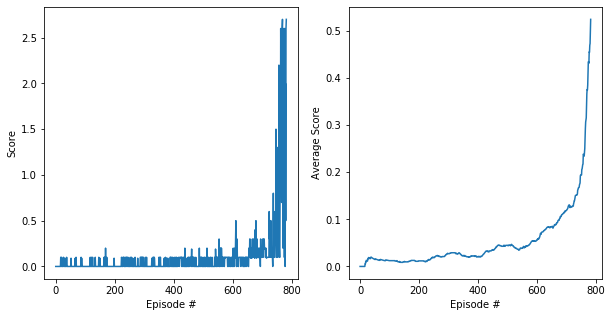

# Deep Reinforcement Learning Nanodegree
# *DRLND-MARL-Collaboration-and-Competition*

## Report on the Implementation of the (chosen) Multi-Agent System

### Implementation

The environment and the multi-agent system are all implemented inside `Tennis.ipynb`. As chapter 1 - 3 were given from the project framework, chapter 4 contains all the implementation necessary to define, to train, and to run the multi-agent system. It consists of the following parts:

* 4.0 Utils
* 4.1 Model Network
* 4.2 Agents
* 4.3 Training
* 4.4 Run the Agents

The implementation and algorithms will be described in the following. Afterwards, results of the implementation and an outlook will be presented.

#### Model Network (Definition)

The model section consists of a generic function `hidden_init` to initialize the weights of the models, an **actor** and a **critic** class. Each of the two classes can be used to define local and target networks resulting in four networks in total per agent.
    
The **actor** network has three fully-connected layers where the first two layers have ReLU-activation functions and the third has a tanh-activation function. The input dimension of the network equals the `state_size` and the output dimension is the `action_size`. The dimensions of the two first hidden layers can be defined by `FC1_SIZE` and `FC2_SIZE` in the implementation block of chapter 4.2. The weights of the fully-connected layers are initialized via the uniform distribution.
    
The **critic** network is build by three fully-connected layers. The input of the first layer is of `state_size + action_size`. The first layer is of dimension `FC1_SIZE` and the second of `FC2_SIZE`. Both are followed by a ReLU-activation function. The third layer matches the input to one output with its linear activation function.

#### Agents (Definition)

In the Agents section, the general settings, the **Agent**, **MADDPG** and **ReplayBuffer** classes are defined.

The multi-agent system is initialized by the class **MADDPG**. During initialization, it calls the class **Agent** (see below) to create the needed agents. The generated actors have input size of `state_size` and output size of `action_size` whereas the critics are of input size `(state_size + action_size) * num_agents`. The class offers the methods `act` and `step` to control the acting and learning of the agents. The method `act` calls the act method of each agent and collects their resulting actions. The method `step` stores the (states, actions, rewarsd, next_states, done)-tuple in the **ReplayBuffer**, controls the learning of each agent (call of method `learn` for each agent) and calls the function `update_targets`. The function `update_targets` and its sub-function `soft_update` update the target parameters by itself and the local parameters by a `TAU`-defined ratio. The methods `save_weights` and `load_weights` support the usage of trained models for later applications.

    
The class **Agent** initializes four models (actor and critic, each gets one for the local development and one for the fixed target). The class uses Adam optimization for both local networks and to be defined parameters learning-rate `LR_A` for the actor and `LR_C` for the ciritc, decay-rate `GAMMA`, and target-update rate `TAU`.    
The class consists of the methods `act` and `learn`. The function `act` determines the epsilon-greedy based action by passing the state through the local actor network and by choosing the result or randomly another action with the help of eps(silon). The `learn` function calculates the mean-square error loss for the critic and the actor. The critic loss is determined by the expected Q-value and the current one. The actor is optimized by the policy (action-state value) loss derived from the local critic network which gets the local actor output as input. It has to be considered that the actor network just calculates the action for each specific agent independently whereas the critic calculates the general action-state value depending on all states and actions of all agents.

The **ReplayBuffer** is implemented to store the (states, actions, rewards, next_states, done)-tuple with the content for all agents. The length of the buffer is defined by `BUFFER_SIZE`. The class owns the functions `add` to add a tuple to the memory and `sample` to create a batch of size `BATCH_SIZE` with elements of the replay memory.    

#### Training (the Agents)

The function `ma_train` trains the agents. For `n_episodes`, it determines, as long as the episode holds, the action by calling `agents.act(states, eps)`, gets the `env_info` from the environment containing the next_states, rewards, and done and performs `agents.step()`.       
Before the function is called, an multi-agent system has to be defined.

#### Run the Agents

In this block, the saved model parameters are loaded into the agents and the agents simulate one episode delivering a score as a result.

### Result

The multi-agent-model has been defined by the `state_size=24`, `action_size=2`, `num_agents=2` and number of neurons in the first hidden layer of 200 (`FC1_SIZE=200`) and for the second of 150 (`FC2_SIZE=150`).    
The replay buffer consists of `BUFFER_SIZE=10000` buffers and generates samples of size `BATCH_SIZE=250`.    
The learning-rate is `LR_A=1e-4` for the actor, `LR_C=1e-3` for the critic, update relationship is `TAU=1e-3`, decay rate is `GAMMA=0.99`.

With these settings, the average score of above 0.5 could be hold for more than 100 episodes!
The model needed 783 episodes to meet the requirements.

### Outlook

The implementation could be enhanced by PPO using trajectories. The quality of the result (number of episodes until the requirement of score >= 0.5) is strongly dependent on the random choices. This could be improved by enhancing the Replay Buffer or making better use of the past experience inside the Replay Buffer.
